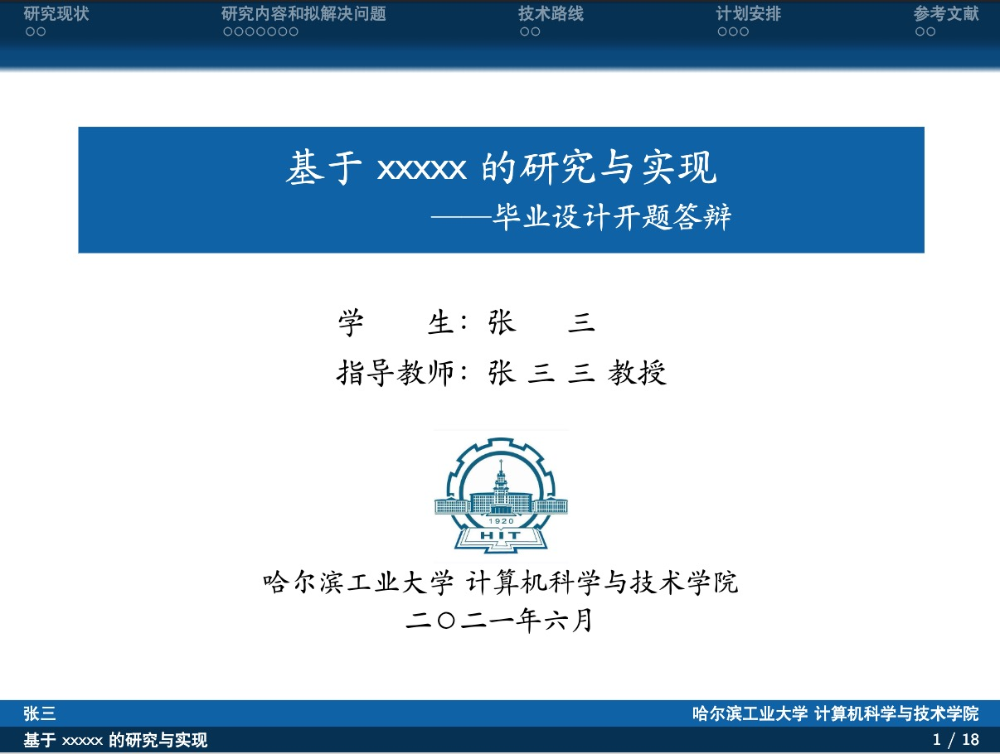
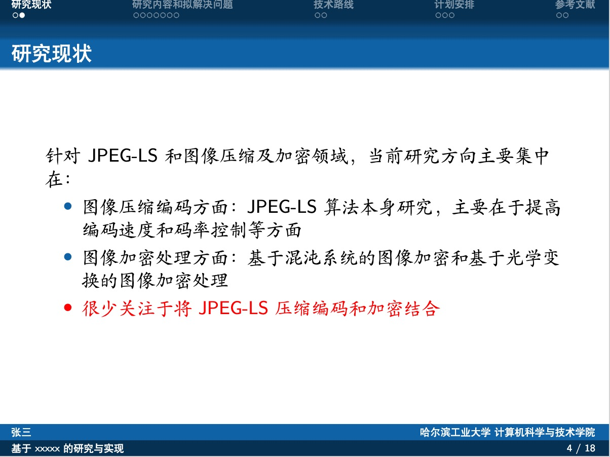

## HIT Beamer Theme
* 下载后直接使用即可
* 非官方模版，仅仅是自己毕设需要做一些ppt而自己略微魔改的
* 原始模版来自于 https://github.com/Trinkle23897/THU-Beamer-Theme

## 一些展示图





> 原来的说明文档：

## College-Beamer-Template

A beamer template which can applied to any college by small modifications:

1. Replace the school bage picture in **/pic** folder.
2. Change the theme color corresponding to your collge in line 39 of **College.sty**:

``` tex
\xdefinecolor{college}{rgb}{0.055,0.383,0.648}  
```

Of course, you can make other small modifications as you like.

